# [Python]某教务系统分析，实现查询成绩

---

## 步骤

### 一、分析教务管理系统的WEB界面实现自动登录

我们从登录入口开始分析，先按F12选择Network，点击Preserve log 和 🚫Clear ，在输入框中随便输入一些数字，然后点击登录。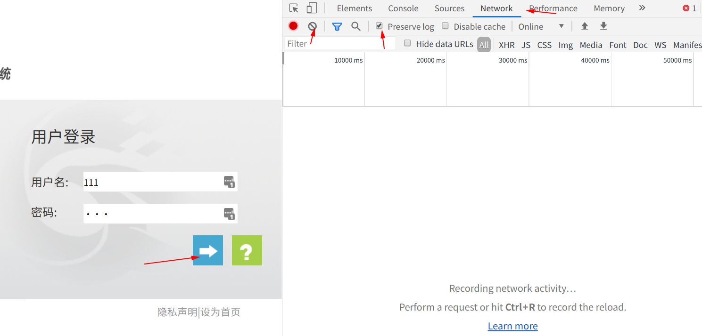


点击发送的第一个请求，观察他的Form表单

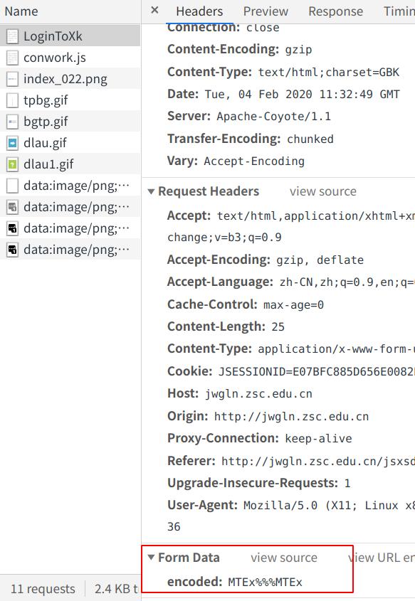

我们发现发送的账号密码数据被加密了，所以想要模拟登录，必须得知道他加密的方法。

我们返回页面，查看源代码，观察登录按钮的事件。

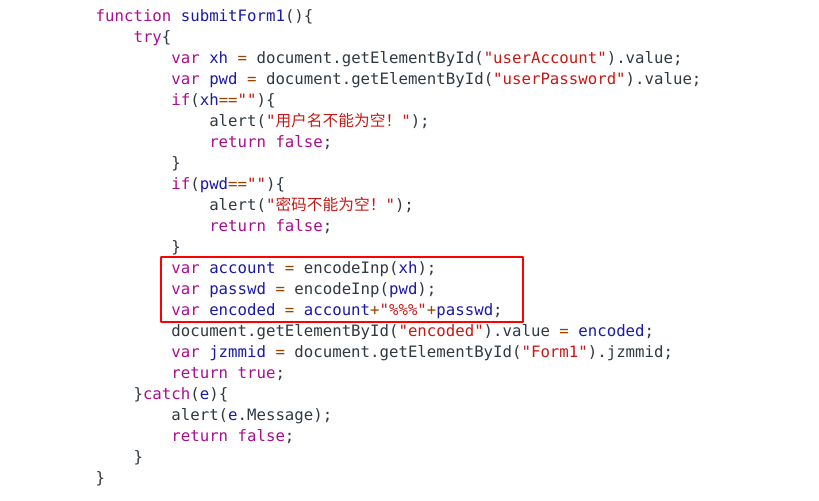

发现在登录时，账号和密码分别被叫encodeInp的函数加密，然后用"%%%"连接起来，和上面中加密的结果一致。

观察网页源代码的头部文件，发现函数被放在了conwork.js中。

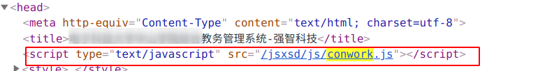

打开之前截取到的请求，找到conwork.js文件，发现被eval加密了，不过可以从百度上随便找个在线网站解密源码。

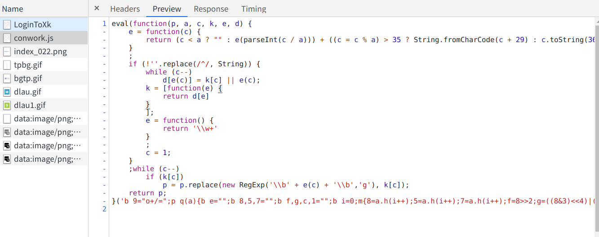

解密后的加密算法长这样的：

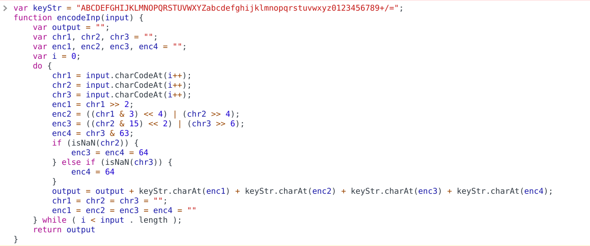

好了，到了这里我们先停一下，先用Python模拟一下自动登录，看看是否能登录成功

### 二、使用Python模拟登录

在模拟登录前，我们先把加密算法写成Python的函数~~（搞了好久才成功）~~。然后用post把加密后的账号密码发送出去，看看能否登录成功。

```python
# -*- coding:utf-8 -*-

from bs4 import BeautifulSoup
import requests
import re


class Spider:
    login_url = 'http://jwgln.zsc.edu.cn/jsxsd/xk/LoginToXk'
    main_url = 'http://jwgln.zsc.edu.cn/jsxsd/framework/xsMain.jsp'
    header = {
        'User-Agent': 'Mozilla/5.0 (Windows NT 6.1; Win64; x64) AppleWebKit/537.36 (KHTML, like Gecko)'
                      ' Chrome/61.0.3163.100 Safari/537.36',
        'Host': 'jwgln.zsc.edu.cn',
        'Referer': 'http://jwgln.zsc.edu.cn/jsxsd/'
    }

    keyStr = "ABCDEFGHIJKLMNOPQRSTUVWXYZabcdefghijklmnopqrstuvwxyz0123456789+/="

    def _encodeInp(self, inputs):
        i = 0
        output = ""
        while True:
            chr2 = chr3 = 0
            chr1 = ord(inputs[i])
            i += 1
            flag2 = False
            if i < len(inputs):
                chr2 = ord(inputs[i])
            else:
                flag2 = True
            i += 1
            flag3 = False
            if i < len(inputs):
                chr3 = ord(inputs[i])
            else:
                flag3 = True
            i += 1
            enc1 = chr1 >> 2
            enc2 = ((chr1 & 3) << 4) | (chr2 >> 4)
            enc3 = ((chr2 & 15) << 2) | (chr3 >> 6)
            enc4 = chr3 & 63
            if flag2:
                enc3 = enc4 = 64
            elif flag3:
                enc4 = 64
            output = output + self.keyStr[enc1] + self.keyStr[enc2] \
                + self.keyStr[enc3] + self.keyStr[enc4]
            if i >= len(inputs):
                break
        return output

    post_data = {

    }

    def login(self, user_id, pass_wd):
        encodes = self._encodeInp(user_id) + '%%%' + self._encodeInp(pass_wd)
        self.post_data['encoded'] = str(encodes)
        r_session = requests.session()
        r_session.post(self.login_url, headers=self.header, data=self.post_data)
        page = r_session.get(self.main_url, headers=self.header)
        return page.text


if __name__ == '__main__':
    spider = Spider()
    UserId = "xxx"
    PassWd = "xxx"
    page = spider.login(UserId, PassWd)
    print(page)

```

我们将结果保存成html，用浏览器打开。

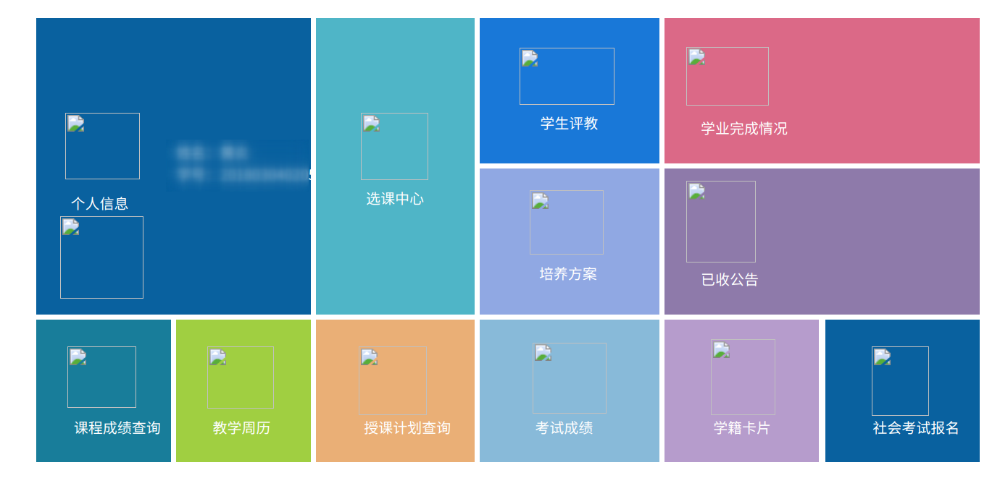

发现登录成功了。到目前为止，其实已经成功了一大半，然后我们开始分析查询成绩发送的数据及URL。

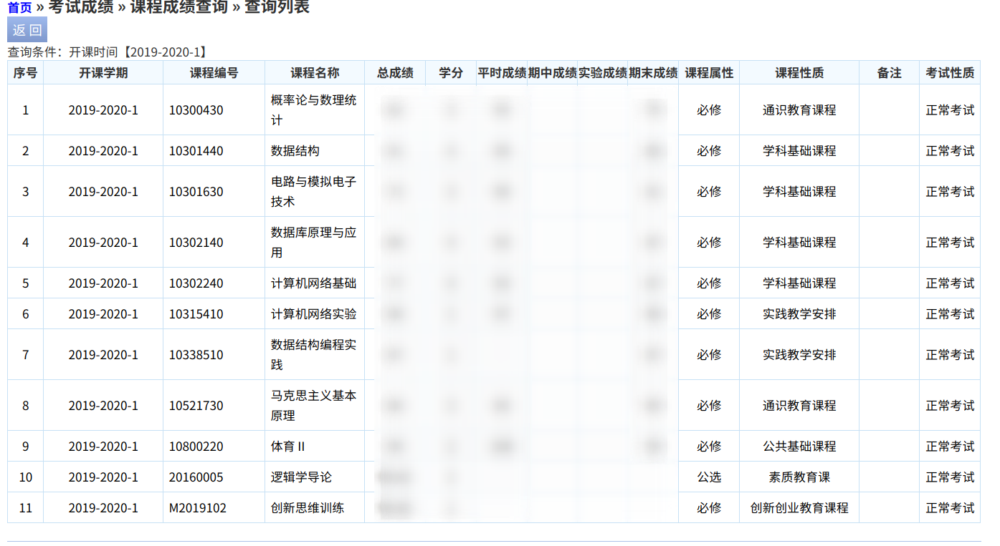

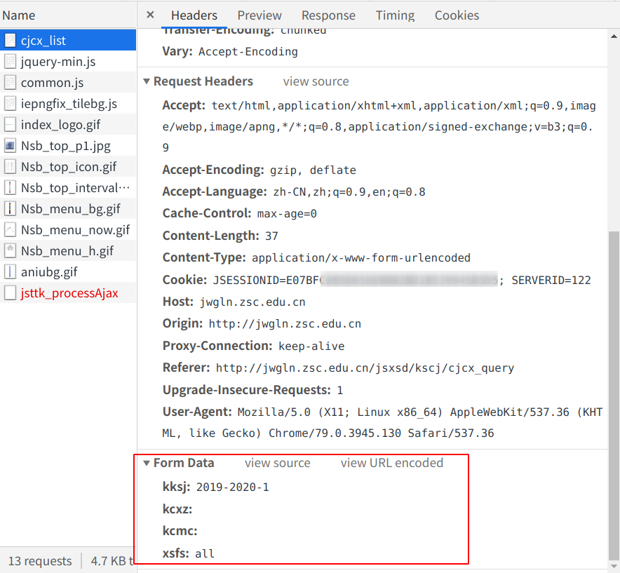

发现只发送一个post请求
分析form表单数据，经过多次试验发现
kksj是查询的学期，kcxz是课程性质，kcmc是课程名称，xsfs是显示方式。我们可以通过修改发送的表单数据筛选想要查询的成绩。

### 三、完善代码

至此我们可以根据分析的结果，修改代码获取想要查看的成绩。我偷了个懒，直接获取所有成绩查询。代码贴在下面：

```python
# -*- coding:utf-8 -*-

from bs4 import BeautifulSoup
import requests
import re
'''
    查询成绩小程序，下方填写账号密码即可一键查询
    使用前务必先安装好必要的python包
'''

UserId = "2018030402055"  # 你的账号/学号
PassWd = "xxx"  # 你的密码


class Spider:
    login_url = 'http://jwgln.zsc.edu.cn/jsxsd/xk/LoginToXk'
    score_url = 'http://jwgln.zsc.edu.cn/jsxsd/kscj/cjcx_list'
    header = {
        'User-Agent': 'Mozilla/5.0 (Windows NT 6.1; Win64; x64) AppleWebKit/537.36 (KHTML, like Gecko)'
                      ' Chrome/61.0.3163.100 Safari/537.36',
        'Host': 'jwgln.zsc.edu.cn',
        'Referer': 'http://jwgln.zsc.edu.cn/jsxsd/'
    }

    keyStr = "ABCDEFGHIJKLMNOPQRSTUVWXYZabcdefghijklmnopqrstuvwxyz0123456789+/="

    def _encodeInp(self, inputs):
        i = 0
        output = ""
        while True:
            chr2 = chr3 = 0
            chr1 = ord(inputs[i])
            i += 1
            flag2 = False
            if i < len(inputs):
                chr2 = ord(inputs[i])
            else:
                flag2 = True
            i += 1
            flag3 = False
            if i < len(inputs):
                chr3 = ord(inputs[i])
            else:
                flag3 = True
            i += 1
            enc1 = chr1 >> 2
            enc2 = ((chr1 & 3) << 4) | (chr2 >> 4)
            enc3 = ((chr2 & 15) << 2) | (chr3 >> 6)
            enc4 = chr3 & 63
            if flag2:
                enc3 = enc4 = 64
            elif flag3:
                enc4 = 64
            output = output + self.keyStr[enc1] + self.keyStr[enc2] \
                + self.keyStr[enc3] + self.keyStr[enc4]
            if i >= len(inputs):
                break
        return output

    post_data = {

    }

    def login(self, user_id, pass_wd):
        encodes = self._encodeInp(user_id) + '%%%' + self._encodeInp(pass_wd)
        self.post_data['encoded'] = str(encodes)
        r_session = requests.session()
        r_session.post(self.login_url, headers=self.header, data=self.post_data)
        return r_session

    def get_page(self, r_session):
        response = r_session.get(self.score_url, headers=self.header)
        # print(response.text)
        text = response.text
        login_status = False
        if re.match(re.compile('.*请先登录系统.*', re.S), text) is None:
            login_status = True
        print(login_status)
        #print(text)
        return login_status, text

    def parse_page(self, page):
        b_soup = BeautifulSoup(page, 'lxml')
        raw_form = b_soup.find_all('tr')
        n = 1
        list = []
        for raw_row in raw_form:
            if n != 3:
                n += 1
                continue
            one_row = raw_row.find_all('td')
            smalllist = []
            for data in one_row:
                if len(str(data.string).strip()) == 0:
                    # print("None", end=' |')
                    smalllist.append(str("None"))
                else:
                    #print(str(data.string).strip(), end=' |')
                    smalllist.append(str(data.string))

            list.append(smalllist)
            #print('')

            #print('-' * 50)
        return list


def main():
    spider = Spider()
    login_session = spider.login(UserId, PassWd)
    status, page = spider.get_page(login_session)
    if not status:
        print('login error')
        #print(page)
        return
    list = spider.parse_page(page)
    # list 是成绩的列表。想要人性化显示，需自行遍历打印
    print(list)
	

if __name__ == '__main__':
    main()

```

---

### 四、用Gui显示成绩

没什么好说的，单纯美化一下界面，毕竟控制台有点不好查看。

效果如下：

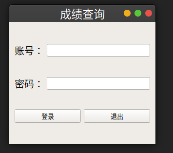

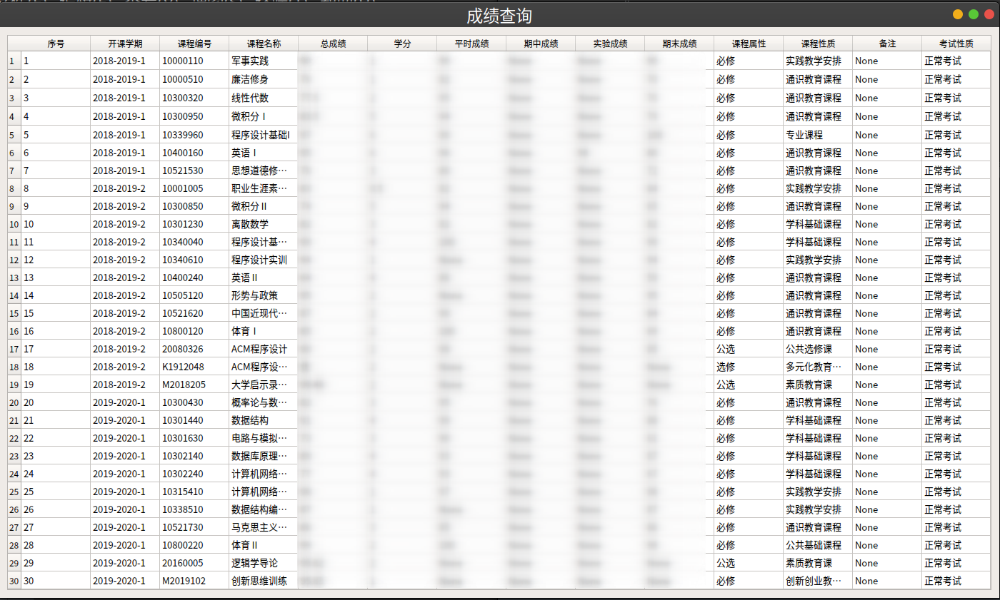


代码：

```python
import sys
from PyQt5.QtWidgets import *
from PyQt5.QtGui import *
from PyQt5.QtCore import *
from scoreFetch import *

'''
    带有gui的成绩查询程序,可以修改下方账号密码方便登录
'''

UserId = "2018030402055"  # 账号
PassWd = ""  # 密码

class MainWindow(QWidget):
    def __init__(self):
        super().__init__()
        self.initWindow()
        self.initUI()
        self.show()

    def center(self):
        qr = self.frameGeometry()
        cp = QDesktopWidget().availableGeometry().center()
        qr.moveCenter(cp)
        self.move(qr.topLeft())

    def initWindow(self):
        self.resize(300, 250)
        self.center()
        self.setWindowTitle('成绩查询')

    def initUI(self):
        self.vbox = QVBoxLayout()
        # grid.addWidget()
        self.init_input_box(self.vbox)
        self.init_button(self.vbox)
        self.setLayout(self.vbox)

    def init_input_box(self, grid):
        self.user_hbox = QHBoxLayout()
        self.user_label = QLabel('账号：')
        self.user_label.setFont(QFont('SansSerif', 15))
        self.user_label.resize(self.user_label.sizeHint())
        self.user_input = QLineEdit()
        self.user_input.resize(50, 60)
        self.user_input.setText(UserId)
        self.user_hbox.addWidget(self.user_label)
        self.user_hbox.addWidget(self.user_input)
        grid.addLayout(self.user_hbox)
        self.passwd_hbox = QHBoxLayout()
        self.passwd_label = QLabel('密码：')
        self.passwd_label.setFont(QFont('SansSerif', 15))
        self.passwd_label.resize(self.passwd_label.sizeHint())
        self.passwd_input = QLineEdit()
        self.passwd_input.setEchoMode(2)
        self.passwd_input.setText(PassWd)
        self.passwd_hbox.addWidget(self.passwd_label)
        self.passwd_hbox.addWidget(self.passwd_input)
        grid.addLayout(self.passwd_hbox)

    def init_button(self, grid):
        # grid.addStretch(1)
        self.hbox = QHBoxLayout()
        self.login_button = QPushButton("登录")
        self.login_button.setFont(QFont('SansSerif', 10))
        self.login_button.clicked.connect(lambda: self.login_check())
        # self.login_button.setShortcut(QtCore.Qt.Key_Enter)
        self.hbox.addWidget(self.login_button)

        self.q_button = QPushButton("退出")
        self.q_button.setFont(QFont('SansSerif', 10))
        self.q_button.clicked.connect(lambda: QCoreApplication.instance().quit())
        self.hbox.addWidget(self.q_button)

        grid.addLayout(self.hbox)

    def login_check(self):
        user_id = self.user_input.text()
        passwd = self.passwd_input.text()
        if len(user_id) == 0 or len(passwd) == 0:
            QMessageBox.about(self, "警告", "请输入账号或密码")
            return
        # print(user_id)
        # print(passwd)
        spider = Spider()
        r_session = spider.login(user_id, passwd)
        login_status, page = spider.get_page(r_session)

        if not login_status:
            QMessageBox.about(self, "警告", "请输入正确的账号或密码")
            return

        lists = spider.parse_page(page)
        # print(lists)
        self.init_score_form(lists)

    def del_layout(self, grid):
        self.hbox.removeWidget(self.login_button)
        self.hbox.removeWidget(self.q_button)
        self.user_hbox.removeWidget(self.user_label)
        self.user_hbox.removeWidget(self.user_input)
        self.passwd_hbox.removeWidget(self.passwd_label)
        self.passwd_hbox.removeWidget(self.passwd_input)

    def init_score_form(self, lists):
        self.resize(1400, 800)
        self.center()
        self.del_layout(self.vbox)
        clen = len(lists)
        rlen = len(lists[0])
        table = QTableWidget(clen, rlen)
        # table.verticalHeader().hide()
        table.setHorizontalHeaderLabels(['序号', '开课学期', '课程编号', '课程名称', '总成绩',
                                         '学分', '平时成绩', '期中成绩', '实验成绩', '期末成绩',
                                         '课程属性', '课程性质', '备注', '考试性质'])
        table.horizontalHeader().setSectionResizeMode(1)
        table.verticalHeader().setSectionResizeMode(1)
        table.setEditTriggers(QAbstractItemView.NoEditTriggers)
        # table.setSortingEnabled(True)

        for i in range(clen):
            for j in range(rlen):
                item = QTableWidgetItem(str(lists[i][j]))
                item.setFont(QFont('SansSerif', 10))
                # print(str(lists[i][j]))
                # item.setTextAlignment(Qt.AlignHCenter | Qt.AlignVCenter)
                table.setItem(i, j, item)

        self.vbox.addWidget(table)

    def keyPressEvent(self, e):
        if e.key() == Qt.Key_Escape:
            self.close()
        elif str(e.key()) == '16777220':
            self.login_check()


if __name__ == '__main__':
    app = QApplication(sys.argv)
    window = MainWindow()
    sys.exit(app.exec_())

```

---

## **扩展**

手动查成绩的方法还是太过麻烦，下学期决定将程序放服务器上实现自动查询并存入数据库。如果有新的成绩出现，自动发送短信通知。
